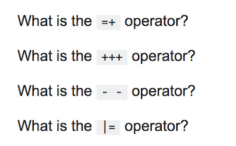
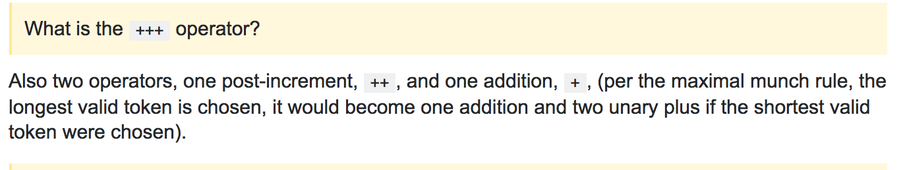
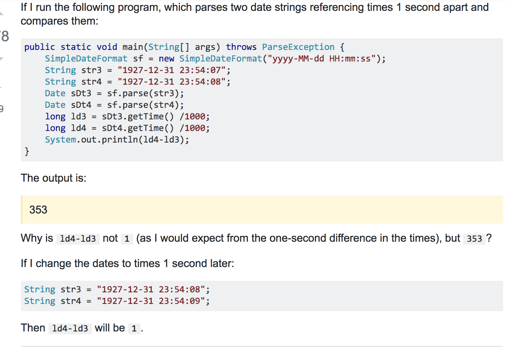
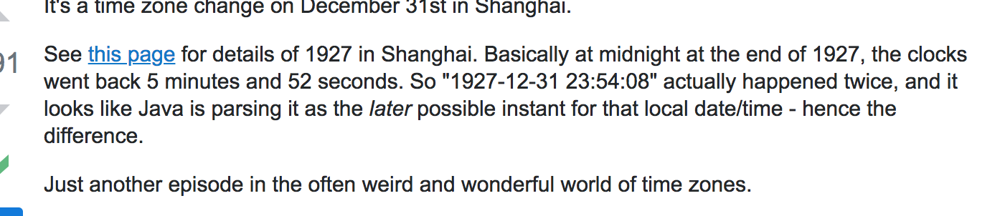

Asking a question is a right, but obtaining a meaningful and well thought out answer in return is a privilege. Now that anyone with internet connection has direct access to the wonderful website known as Google a person’s need to ask others a question (a dumb question that is) has decreased significantly. But unfortunately due to laziness and the lack of observation, dumb questions are still around today. Take a look at this question [here](https://stackoverflow.com/questions/13519990/why-does-i-j-k-j-i-kk-i-j-11): 

## The dumb questions

The user here is trying to understand the code that is shown but at the same time doesn’t know about certain symbols that exist within the code. These symbols are simple to the java language and can be easily learned about through one Google search. Not only did the user skip doing the research but also asks the question of “How does this work?” Asking this type of question is much harder to answer compared to the user attempting to understand the code, and showing where he or she got stuck. After first attempting to solve the problem yourself, the question goes from “How does this work?” to “Why does this work?”

Here we can see an answer to one of the questions about the operators. It would have been much more efficient to Google what the symbols meant and possibly find a link like Wikipedia to learn it from rather than needing someone else to retype the definition for the user. 

## The smart questions

On the other hand we do have examples of smart [questions](https://stackoverflow.com/questions/6841333/why-is-subtracting-these-two-times-in-1927-giving-a-strange-result) :

The user here explains step by step the thinking process and what is going on in the user’s head as they run through this code. The user talks about the answer they expected and even shows changing the code and experimenting with different expected results. Considering the fact that this user did the research and attempted going through the problem themselves, it unexpectedly turned out that the problem being encountered didn’t have anything to do with the code but instead with difference in time zones.

## Software engineers and their questions

This shows why asking smart questions is so important. Smart questions from smart software engineers help them to perform smart deeds. By coming together and helping each other to understand various problems they may be having will put them on the path of reaching greater heights. I learned that if I spend the extra time and think about problems before asking for help I will never ask the question of “how does this work?” but instead always ask “why does this work?”

