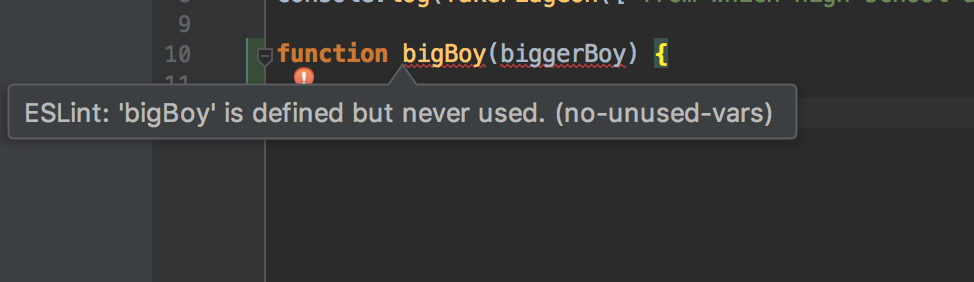

## Code needs formatting too?

Why does code even need coding standards? It’s already hard enough to write! Ha, Just kidding. Like anything else, things need to be done a certain way so that it makes sense to certain people. This can be seen a lot in school. For example, consider a math problem that a teacher got the right answer for but the student did not. If the student used a different method to get to his or her answer and asks for help, we may come to find out that the teacher might have a harder time trying to find out where the student went wrong because the student did not abide to the regular standard. In our case, consider coding in a group project, where there is no coding standards, different contributors to the group may be writing code that does the same thing, but when they take a look at each other’s code they may find it difficult to make sense of. Where there is a problem, finding the bug can take longer if there are no coding standards. In short, coding standards can significantly improve a programmer’s efficiency.

## My first encounter
My first encounter with coding standards was during my Introduction to Computer Science II course at the University of Hawaii at Manoa. Previously, I had learned to code in the Java programming language in Intro to CS I with no coding standards whatsoever. This meant that I was obliged to write my code in any way that I pleased. Coding with a coding standard was definitely irritating in the beginning, from being coding standard free for one whole semester to having to write JavaDoc comments for every single function I wrote definitely took some time to get used to. And when I say every single function, I mean it, even if it was a function so simple that did something like adding 1 and 2. 

My biggest hurdle in learning my first coding standards was learning where to place brackets when creating a new function. All throughout my ICS I course I always indented the first open bracket that comes when you create a function. I found that this way was better for me initially because after completing your function with a closing bracket, all brackets that were created from that function lined up in my editor. It was a true beauty. I came to find out that in almost all coding standards you leave the open bracket next to where you create the function. Although I was only keeping myself from one return button, it definitely made me annoyed early in my programming career. Now leaving my open bracket next to my function declaration is like second nature to me. So although it may seem like a lot in the beginning, we programmers learn to adapt.

##ESLINT give me a hint
Currently, I am taking ICS 314 Software Engineering, which has introduced a new coding standard known as ESLINT. So far I have found that adhering to most of the coding standards is nothing major because I have seen it before in previous classes like Intro to CS II. One thing I am not to fond about that takes place in ESLINT is that it shows errors as soon as you finish writing your line of code. This can bother me because I can create a new function and I will already receive an error about “not using the function” when I haven’t even finished writing the function. These minute errors give me sudden urges to hover my mouse over that red squiggly and try to correct it so that I can get the good old green check mark, which essentially can inhibit thought process. 
Overall, I believe coding standards are excellent to implement and every programmer should learn some form of coding standards early on in their career. It will be much better to get it out of the way in the beginning versus having to pick it up further down the line. 
