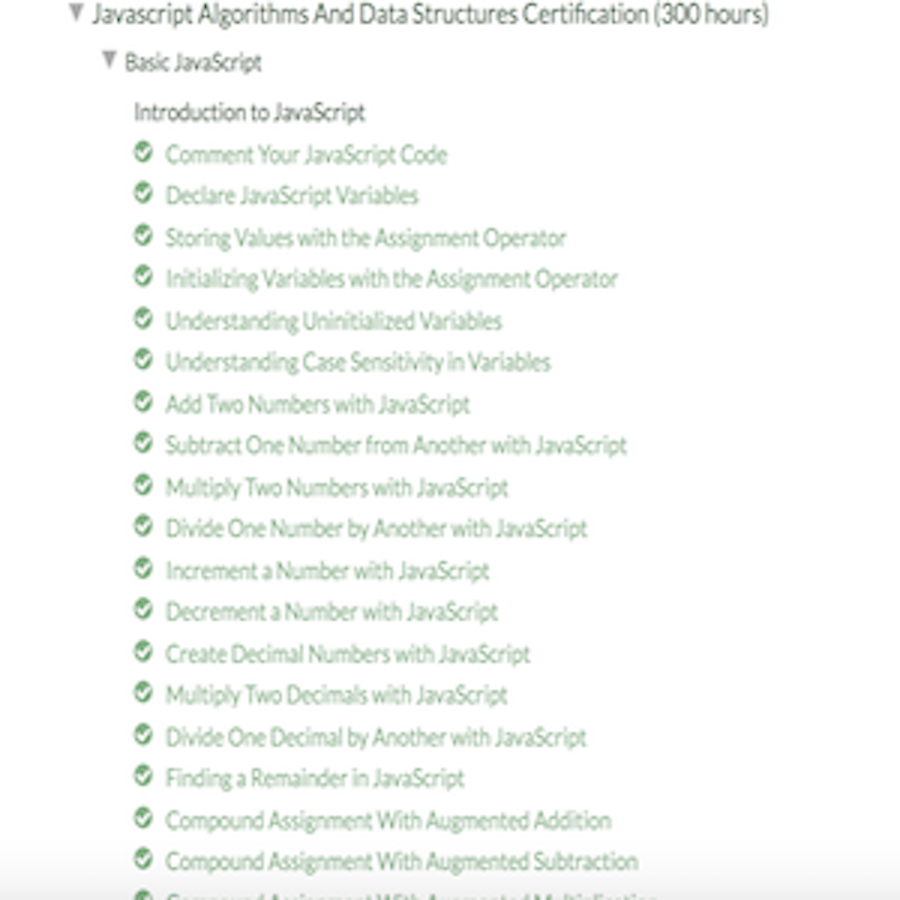

## Back to School
This past week was my first week back to school for my second year of college majoring in computer science. On the Tuesday of that first week I had a class called ICS 314 Software Engineering. In this class the teacher talked about how we would be dealing with JavaScript and how we would be tested on it by the following week. This meant I would need to transition from having no knowledge about the language to being familiar with writing it in one week. To do so we were prompted to complete the introductory section of JavaScript on the "freecodecamp" website which according to the website was projected to be 10 hours in length. 

## Java vs JavaScript
During my freshman year I learned the Java language and practiced it throughout the year. Being that I needed to learn a new language in one week caused me to be nervous but also engaged in the challenge. I was confident that my prior Java experience would significantly help in learning a new programming language. It turns out that I couldn't have been more right. In the introductory stages, Java and JavaScript seemed almost identical. It felt as if I was being taught what I had already knew. The two languages are very similar, which turned out to be a good thing and a bad thing. A good thing because it was easier for me to pick up but a bad thing at the same time because I was so used to writing Java code that when I wrote JavaScript I still had old habits that were very minor differences between the two languages, for example variable declaration.

Considering the fact that I still have so much to learn about the JavaScript language, I am still unsure of whether or not JavaScript is a good language in the software engineering perspective, but in my opinion, so far so good. 
## Working out every day
Being tested on a language that was new to me through various coding challenges and only having a certain amount of time to finish. So this is athletic software engineering. The practice is definitely nerve-wracking but at the same time extremely effective. It builds confidence in my abilities to solve problems through writing code. I found practice WODs to be helpful for becoming more familiar with writing JavaScript code. I feel that the athletic software engineering practice is a good way to learn, but like anything else, you get what you put in. The only way to become an athletic software engineer is through practice. 

