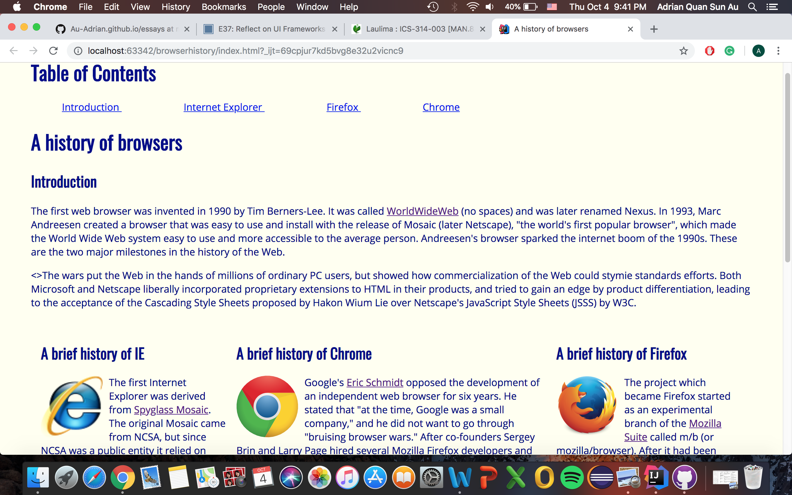
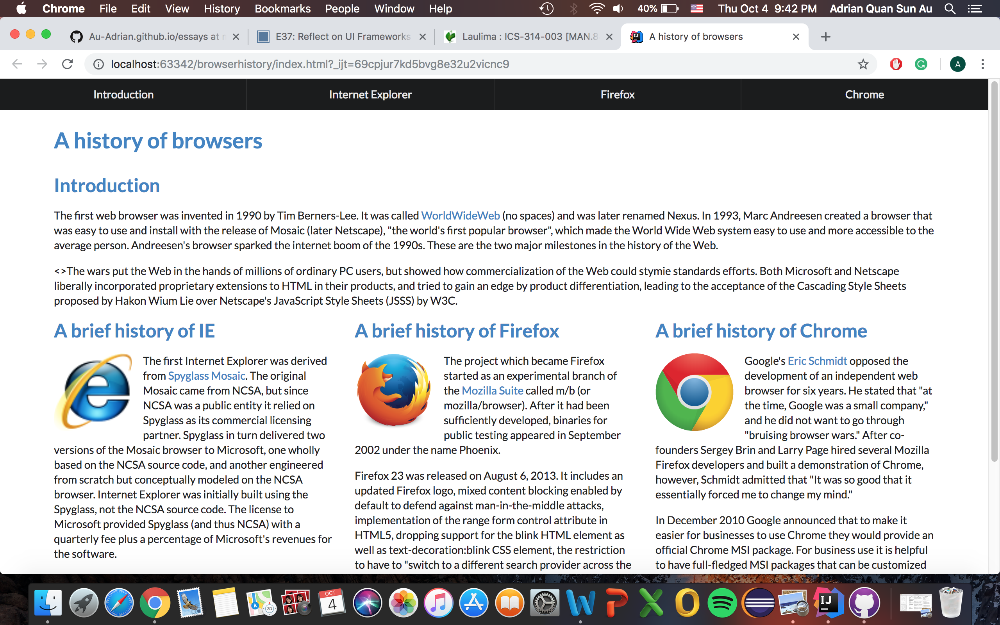

## There's code for coding languages?

I just spent hours learning hypertext markup language and cascading style sheets, and now you’re telling me I have to learn some framework called semantic ui?  Although it may seem like a complex task, learning new languages and frameworks makes a programmer’s life much easier in the long run. The more languages and frameworks a programmer knows, the more experience and strategies the programmer will obtain. Giving he or she the ability to complete tasks that they have always been doing but now more efficiently. I like to think of this as having a “work smarter not harder” mindset. By taking the time to learn new skills, we can get the same amount of work done but now with less effort. 

## I need an example

Take a trip back to calculus class when we were first introduced to derivatives, oh the good old times. If you remember correctly, you were most likely taught the limit definition used to solving derivatives. This limit definition was the origin of where all derivatives came from, so the course that I took required us to know how to use the limit definition before moving on to more advanced derivatives. To derive using the limit definition you were required to undergo a rigorous amount of algebra that was very detailed and very easy to make a mistake on. Later on in that class, we would come to find out that there are methods like “power rule” and “multiplication rule” that would give us the same derivative with significantly less work. Although these methods were way easier, we needed to learn and understand the limit definition before being able to apply different techniques such as “power rule” and multiplication rule”. This is very similar to learning html and css, and then learning semantic ui. Where learning html and css is like deriving using the limit definition, and semantic ui is like deriving using the “power rule”. 
  
## Are the benefits truly worth it?

Efficiency is just one of the many software engineering benefits that come with ui frameworks. Not only does a framework make things easier, it also makes things look a lot better, which I believe is appreciated by the majority. Take a look at the difference in these pictures here, you can probably guess which webpage was created through raw html and css and the webpage that has semantic ui integrated into it. I’m sure my point is coming across now. Not only does the page with semantic ui look significantly better, but the code required to make these changes was miniscule and not complex at all!

  
  

In conclusion, learning new languages and frameworks will always be a benefit to any programmer, even though it may seem like a daunting test. Regardless, programmers should always be encouraged to putting in the extra time and effort so that they can begin to work smarter, not harder.

