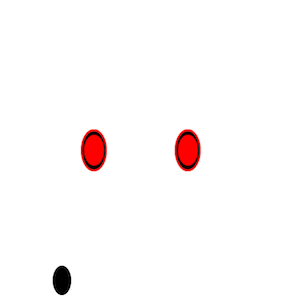

  

This project was made in my Introduction to Computer Science 111 class at the University of Hawaii at Manoa. The project is an air hockey simulator that could be played on your computer when you ran the program. After running the program a seperate window would appear showing 2 strikers and the puck. The strikers could be interacted with through the computer by using the "w,a,s,d" keys and the "i,j,k,l" keys. The rules followed similar to basic air hockey, you must use the striker to defend your goal or try to score the puck inside of your opponent's goal.

I worked with 2 other students on this project. My resposibility consisted of coding the keyboard interaction with the striker objects, puck to striker collision, puck to wall collision, and striker to wall collision. My 2 partners worked on the background of the airhockey window, the scoring system, and the game timer (All which is not shown here). Together, my teammates and I managed to get full credit for this assignment.

