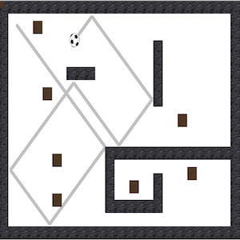

This project was made during Introduction to Computer Science I at the University of Hawaii at Manoa. The project simulates movements of a roomba moving around a typical 2 dimensional floor plan. The brown blocks portray pieces of dirt that disappear if the roomba collides with them. The gray marks near the roomba show the path that the roomba has already taken. 

To create this program I coded the actual floor plan that is seen by programming Java to place pictures of blocks when a certain key was found, as well as the roomba collision and trail path. 

From this project I learned more about what I can do with Java and more about Java syntax. For example, I learned how to integrate cool effects like sounds while my program is running and using pictures of my choice. 
You can watch a video of the simulation [here](https://www.youtube.com/watch?v=ELQtaxgoxBY)
