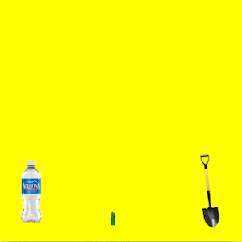

This simulation was my first project that I created in Introduction to Computer Science I at the University of Hawaii at Manoa. This program gives the user a feel for what it is like to be a farmer. When you start the program, the taro starts off in a healthy stage, as time goes on, you must evenly distribute water and soil to the taro to keep it healthy and to get it to reach the fully grown stage. If you distributed too much water, the taro would become unhealthy and the program would end. Vice versa in regards to soil. Once the taro reached a certain stage, the program would end by saying "You win!". 

During this project I was exposed to the different kinds of things that you could do in Java. This project might be the most important one to me so far because it was the first exposure that I had to coding and grasping a basic understanding of simple tools such as for loops and if statements. 

From this project I learned about what kind of mentality you need when approaching code. Although a lot of it is challenging, it is amazing to see that the only limit that you have while coding is your imagination. I also learned more about myself, I found out that I wanted to learn more about the discipline and see where it takes me. 
You can watch a video of the simulation [here](https://www.youtube.com/watch?v=D99bxXE2I44)  
