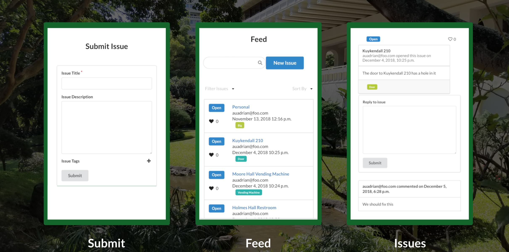
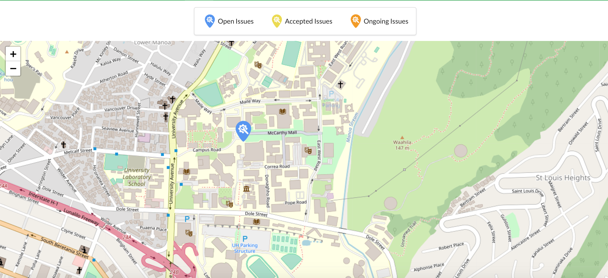

The root of this project came from the fact that the University of Hawaii at Manoa has an existing problem hotline that needs to be called to report a problem. This process takes time and is inconvenient to the student and ends up discouraging the student from reporting the problem. Our solution was to create an application that was easy to use so that students around the campus would be encouraged to report problems. We did this by making the application mobile friendly, meaning that the application functioned well on a cell phone. The application is run on the internet, but we wouldn't want students to need to pull out their computers just to report a problem. We created this app with the belief that students should be able to submit issues from their handheld devices in less than 2 minutes. 

Upon first visiting our application you are greeted with our landing page, where it first prompts you with the option to sign in or sign up if you have not made an account. 

After signing in the options to sign in or sign up is replaced with the option to "Submit an Issue". We made it this way so that our users would be focused on doing what they came to do, reporting the issue that they found. 

On the top left you can see a navigation bar which holds other features of our application. As you can see from the picture, users have the ability to submit an issue, giving it a title, a description, and even tags. Our feed page shows a list of issues that other users may have posted. Users can also see the issue's status, and even drop a like if the user agrees with the issue. Upon clicking on an isssue, you are brought to the issue page where users are given an option to reply to another user's issue. The screenshots of the submit, feed, and issue page all came from a mobile device, so you can see how user-friendly our application is. 

The special sauce we added to our project was the use of an active map which would set a marker to where a user submits an issue. While viewing the map you can see other user's issues and the status of their issue according to the color. Although this is a cool feature that some enjoy being able to use, the only way we could get it to work is if our users allowed us to access their location while using the app so that we could mark it on the map. While getting user feedback from the community we learned that there are a few users who prefer to keep their locations private when using online applications. 

My contributions to this project were majorly issues that dealt with the front-end side of things. For example, on the issue page I was responsible for making the page responsive to mobile devices. Originally, the webpage did not scale to our phones and a user would need to zoom in and out to be able to select on different textboxes within the application. I made it so that everything on the issue page scaled and did not inhibit a user's experience. Something else to add on to front-end changes would be a discovery we made when creating issues. We found that when creating issues with too much text, part of our page would begin to push off to the side and the layout of our application would become altered. I helped change our application so that the text among various textboxes would not reach this point by testing various edge cases. Along with changes like these, I was in charge of creating the instructions and processes to go through when a user is allowing location access. 

Working on this project together with my partners; Graham Francisco, and Gian Calica taught me a lot about Software Engineering. First and foremost, I learned that the importance of communication and teamwork becomes the foundation of how well your project will turn out. Without the constant discord messages, github issues, and meetings during class time our project would be nowhere near successful as it is now. I learned that as a software engineer I will always be forced to make extra searches for questions that I don't know how to answer and will be constantly researching to complete different tasks. This is interesting to me because it differs from your standard college course where everything you learn in class is what you need to know for the test. Dr. Johnson put us on the right track through the different modules and screencasts to get our project started but we would not be able to finish without doing outside research. In smaller words, it's impossible to know how to do everything in the world of software engineering. The most important thing that I learned is that I can always be improving by doing the extra bit of research to help not only myself but my teammates as well.

If you are interested, you can find the link to our project repository [here](https://github.com/manoafixit/manoafixit)
You can also find a the link to our actual project [here](https://manoafixit.meteorapp.com/#/)
